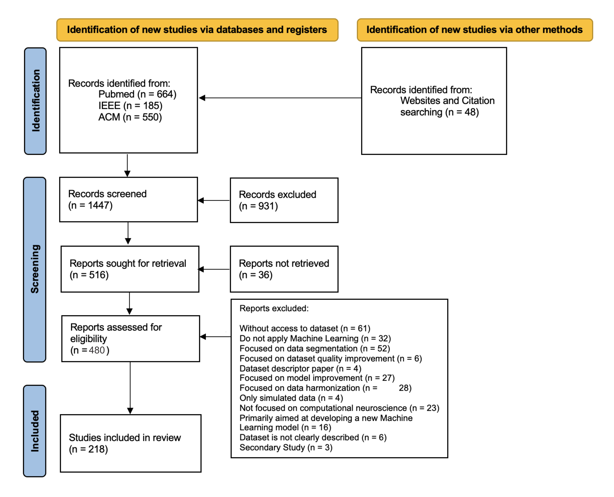

# Data-Centric Artificial Intelligence in Computational Neuroscience: A Scoping Review of Datasets, Models, and Applications

Repository of supplementary materials for the scoping review submitted to the **International Conference on Artificial Intelligence, Computer, Data Sciences and Applications (ACDSA 2027)**.

## About the Study

The study investigates the characteristics of datasets used in Artificial Intelligence (AI)-based computational neuroscience, including dataset availability, scale, neurological modalities, geographic origin, AI models, learning paradigms, and documentation practices. The review also examines the relationships among datasets, neurological modalities, and AI models, with a focus on their implications for reproducibility and generalization.

The review included **218 studies published between 2015 and 2025**.

## Research Question

Accordingly, the central research question is:

*"What are the key characteristics, applications, limitations, and future potential of datasets used in Artificial Intelligence models within computational neuroscience research, as reported in English-language academic, clinical, or experimental studies over the last decade?"*

## Methodology

The scoping review was conducted in accordance with the JBI Manual for Evidence Synthesis and reported following the PRISMA Extension for Scoping Reviews (PRISMA-ScR) guidelines.

The review considered studies published in English between 2015 and 2025 and focused on studies applying machine learning or deep learning methods to real neurological datasets, including MRI/fMRI, EEG, MEG, PET, and related biomarkers. Studies focused exclusively on segmentation, data harmonization, methodological model development without dataset-oriented analysis, or without machine learning applications were excluded.

## Search Strategy

The literature searches were conducted in the following databases:

* PubMed
* IEEE Xplore
* ACM Digital Library

The search strategy was standardized and applied consistently across all selected databases to ensure comprehensiveness and reproducibility of the results. To construct the search string, the following conceptual model was used as a base, ensuring coverage of key components in the research scope:

**AI/KEY TERMS** AND

**SCANS/EXAMINATIONS** AND

**COMPUTATIONAL MODELS** AND

**BIOLOGICAL CONTEXT** AND

**DATASET**

Below is the full search string used across all databases:

```text
((("artificial intelligence" OR "machine learning" OR "deep learning" OR "neural network" OR
"learning machine" OR "deep machine learning" OR "deep ML" OR "algorithmic neural network" OR
"ANN” OR "artificial neural networks" OR "computational intelligence" OR "supervised machine
learning" OR "supervised machine" OR "unsupervised machine learning" OR "pattern recognition")
AND
("fMRI" OR "Functional Magnetic Resonance Imaging" OR "functional MRI" OR "brain scan" OR
"brain imaging" OR "Brain Mapping" OR "neural recording" OR "neurophysiology" OR "Magnetic
Resonance Imaging" OR "MEG" OR "Functional Brain Imaging" OR "neuroimaging biomarkers")
AND
("neuroscience" OR "computational" OR "modeling" OR "computational neuroscience" OR
"cognitive computational neuroscience" OR "theoretical neuroscience" OR "Neuroinformatic")
AND
("dataset" OR "data set” OR "neural dataset" OR "database" OR "data repository" OR "data
repositories"))
AND
("neuroscience"))
```


## Study Selection

The study selection process was conducted in two main stages: screening of titles and abstracts, followed by full-text assessment. Initially, all references obtained from database searches were imported into the *Rayyan* reference management software, where duplicates were removed. Next, four independent and blinded reviewers, organized into two pairs, screened the titles and abstracts based on pre-established eligibility criteria. Potentially relevant studies then underwent full-text reading, which was also be carried out independently. Additionally to studies retrieved from database searches, a manual search was conducted to identify relevant datasets in repositories. If a paper was found to be associated with any of these datasets, it was included in the review. Any disagreements during the selection process were resolved by consensus or with the involvement of an external reviewer.


## Data Extraction

The spreadsheets used for data organization and extraction are available in:

→ [Data Extraction Spreadsheet](data/data_extraction.xlsx)

## PRISMA-ScR Flow Diagram

The flow diagram describing the study identification, screening, eligibility, and inclusion process:



